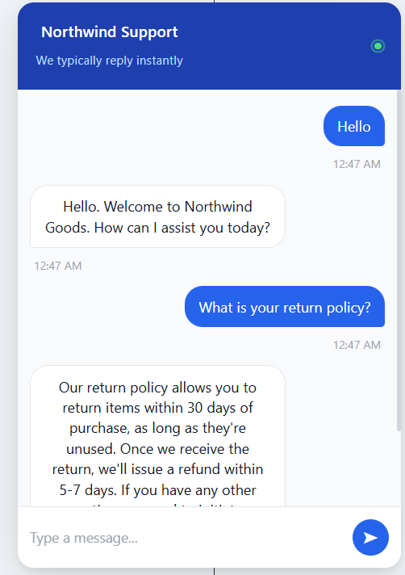

# Northwind Goods - AI Live Chat Support Agent

An AI-powered live chat support agent for **Northwind Goods**, a fictional online store. A Svelte chat widget talks to a standalone Express API that persists conversations in PostgreSQL and generates replies with **Groq (Llama 3.3)** over an OpenAI-compatible SDK.

Built as a take-home assignment for **Spur**.

---

## Screenshot



---

## Run Locally

**Prerequisites:** Node 18+, PostgreSQL 16

```bash
# 1. Clone the repo
git clone <repo-url>
cd spur-chat-agent

# 2. Install backend dependencies
cd backend
npm install

# 3. Install frontend dependencies
cd ../frontend
npm install

# 4. Set up the backend .env (copy the example, then fill in values)
cd ../backend
cp .env.example .env
#   - set DATABASE_URL to your Postgres instance
#   - set GROQ_API_KEY (the active provider; required to boot)

# 5. Set up the frontend .env (copy the example - defaults work locally)
cd ../frontend
cp .env.example .env

# 6. Run the database migration (from backend/)
cd ../backend
npx prisma migrate dev

# This creates two tables:
#   - Conversation (id, channel, createdAt, updatedAt)  
#   - Message (id, conversationId, sender, text, createdAt)
#
# No seed required — data is created automatically when users chat.

# 7. Start the backend  ->  http://localhost:3000
npm run dev

# 8. Start the frontend (new terminal, from frontend/)  ->  http://localhost:5173
cd frontend
npm run dev

# 9. Open the app in your browser
#    http://localhost:5173
```

> On Windows PowerShell, use `copy .env.example .env` instead of `cp`.

---

## Environment Variables

### Backend (`backend/.env`)

| Variable | Description | Required | Default |
| --- | --- | --- | --- |
| `PORT` | Port the Express API listens on | No | `3000` |
| `ALLOWED_ORIGIN` | CORS origin allowed to call the API (the frontend URL) | Yes | - |
| `DATABASE_URL` | PostgreSQL connection string | Yes | - |
| `LLM_PROVIDER` | Active LLM provider: groq \| openai \| gemini | No | `groq` |
| `LLM_MODEL` | Model name for the active provider | No | `llama-3.3-70b-versatile` |
| `GROQ_API_KEY` | API key for Groq | If LLM_PROVIDER=groq | - |
| `OPENAI_API_KEY` | API key for OpenAI | If LLM_PROVIDER=openai | - |
| `GEMINI_API_KEY` | API key for Google Gemini | If LLM_PROVIDER=gemini | - |
| `LLM_TIMEOUT_MS` | Request timeout in ms (all providers) | No | `20000` |
| `LLM_MAX_OUTPUT_TOKENS` | Max tokens in the model's reply (cost cap) | No | `400` |
| `LLM_MAX_HISTORY` | Max past messages sent as context (cost cap) | No | `12` |
| `MAX_MESSAGE_LENGTH` | Max characters allowed per user message | No | `2000` |

### Frontend (`frontend/.env`)

| Variable | Description | Required | Default |
| --- | --- | --- | --- |
| `VITE_API_URL` | Base URL of the backend API | Yes | `http://localhost:3000` |

---

## Switching LLM Providers

Switching providers requires only `.env` changes - no code edits needed.

**Groq** (default, free - https://console.groq.com):

```bash
LLM_PROVIDER=groq
LLM_MODEL=llama-3.3-70b-versatile
GROQ_API_KEY=gsk_...
```

**OpenAI** (https://platform.openai.com/api-keys):

```bash
LLM_PROVIDER=openai
LLM_MODEL=gpt-4o-mini
OPENAI_API_KEY=sk-...
```

**Google Gemini** (https://aistudio.google.com/apikey):

```bash
LLM_PROVIDER=gemini
LLM_MODEL=gemini-2.5-flash
GEMINI_API_KEY=AIza...
```

`llm/index.ts` reads `LLM_PROVIDER` at startup and instantiates the correct provider. The rest of the app is unaware of which provider is active.

---

## Architecture Overview

The backend is layered so each concern has a single home:

```
backend/src/
  routes/        HTTP layer - validation + status codes, no business logic
    chat.ts      POST /chat/message, GET /chat/:sessionId/messages
    health.ts    GET /health
  services/      Business logic - orchestrates a turn (chat.ts -> handleMessage)
  db/            Data layer - thin Prisma wrappers (conversations.ts, messages.ts)
  llm/           LLM integration - fully encapsulated (see below)
  schemas/       Zod request schemas
  middleware/    Centralized error handler
  config/        Validated env config
```

**routes -> services -> data.** A request flows in one direction: `routes/chat.ts` validates the body and delegates to `services/chat.ts` (`handleMessage`), which coordinates the `db/` layer (Prisma) and the `llm/` layer. Routes never touch Prisma; services never parse HTTP. This keeps each layer independently testable and swappable.

**`llm/` is fully encapsulated.** Every provider implements a single `LLMProvider` interface (`generateReply(messages)`), and the rest of the app only imports `generateReply(history, userMessage)` from `llm/index.ts`. Prompt construction (`prompt.ts`) and provider wiring live entirely inside the folder - **swapping providers is a one-file change in `llm/index.ts`** (e.g. instantiate the OpenAI or Gemini provider instead of Groq). Nothing in `routes/`, `services/`, or `db/` changes.

**`Conversation.channel` makes multi-channel explicit.** Every conversation row carries a `channel` column (defaults to `"web"`). Today only the web widget writes rows, but the column means the data model already distinguishes where a conversation originated - no migration needed to support more sources.

**Where new channels plug in.** A new channel (WhatsApp, Instagram) is an inbound **adapter + route** - e.g. `routes/whatsapp.ts` that receives a webhook, maps it to a message, and calls the same `handleMessage(text, sessionId)` with `channel: "whatsapp"`. The service, LLM, and data layers are channel-agnostic and need no changes; the new code is isolated to a route/adapter.

**Why a standalone Express backend (not SvelteKit full-stack).** The agent is meant to serve *multiple* channels, not just a web page. A standalone API can sit behind a web widget today and WhatsApp/Instagram webhooks tomorrow without coupling business logic to the Svelte rendering layer. It also deploys and scales independently of the frontend and keeps a clean, language-agnostic contract between the two - a better fit than embedding the logic in SvelteKit endpoints.

---

## LLM Notes

- **Providers:** three are supported - **Groq** (`llama-3.3-70b-versatile`, via the OpenAI-compatible SDK at `https://api.groq.com/openai/v1`), **OpenAI** (`gpt-4o-mini`), and **Google Gemini** (`gemini-2.5-flash`). The active provider is selected via `LLM_PROVIDER` in `.env`. All three implement the same `LLMProvider` interface.
- **Prompt strategy** (`llm/prompt.ts`): each request is assembled as
  1. a **system prompt** defining the support persona, concatenated with
  2. **`STORE_KNOWLEDGE`** - shipping, returns, and support-hours facts for Northwind Goods,
  3. the **capped conversation history** (`LLM_MAX_HISTORY` messages), and
  4. the new **user message**.

  History is loaded *before* the new user message is persisted, so the current turn isn't sent to the model twice.
- **Cost caps:**

  | Cap | Value | Effect |
  | --- | --- | --- |
  | `MAX_MESSAGE_LENGTH` | `2000` | Rejects oversized user input at validation |
  | `LLM_MAX_HISTORY` | `12` | Bounds how many past messages become context |
  | `LLM_MAX_OUTPUT_TOKENS` | `400` | Caps tokens in each model reply |

- **Why Groq:** generous free tier, **no credit card required**, and an OpenAI-compatible API - so it's a drop-in for development, and providers can be swapped later via a one-line `.env` change.

---

## Trade-offs & If I Had More Time

**Current limitations**
- **No Redis** - no rate limiting or shared session store; state lives only in Postgres.
- **No streaming** - replies are returned whole after generation rather than streamed token-by-token.
- **Single process** - no horizontal scaling or background workers.
- **Static knowledge** - store facts are a hardcoded string in `prompt.ts`, not retrievable knowledge.
- **No automated tests** and no auth on the history endpoint (a session UUID is the only guard).

**If I had more time**
- **Vector DB / RAG** for the knowledge base so answers scale beyond a hardcoded blob.
- **Streaming responses** over SSE for a faster, more natural feel.
- **Redis** for rate limiting and session/state caching.
- **Channel adapters** for WhatsApp and Instagram webhooks, reusing `handleMessage`.
- **Test suite** - unit tests for services/LLM and integration tests for the routes.

---

## Deployed URL

URL -  https://spur-chat-agent-one.vercel.app

> **Note:** The backend is hosted on Render's free tier and may take 20-30 seconds to respond after a period of inactivity (cold start). Subsequent messages will be fast.


